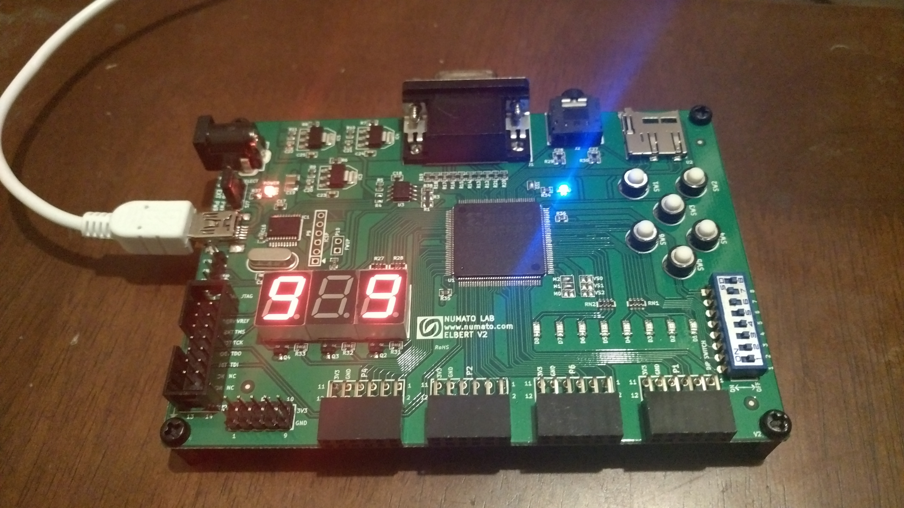

# prog_fpga_elbert2
Experiments listed in Simon Monk's awesome book "Programming FPGAs: Getting Started with Verilog" (http://simonmonk.org/prog_fpgas/)

on Numato Labs Elbert v2 FPGA board (https://numato.com/product/elbert-v2-spartan-3a-fpga-development-board)

Solutions to the Experiments by Simon can be found at: https://github.com/simonmonk/prog_fpgas

# License
The code is distributed under the MIT License. See the LICENSE file for more details.
